# Manual Deployment of a Python Lambda Function on AWS

This guide describes how to manually deploy Python Lambda function on AWS

### Log Into AWS Account

Use the Excel file previously shared with you. Click on the link, enter username and password

### Search for the Lambda Service

In the AWS Management Console, type `lambda` into the search bar in the top-right corner

  
Example

  
  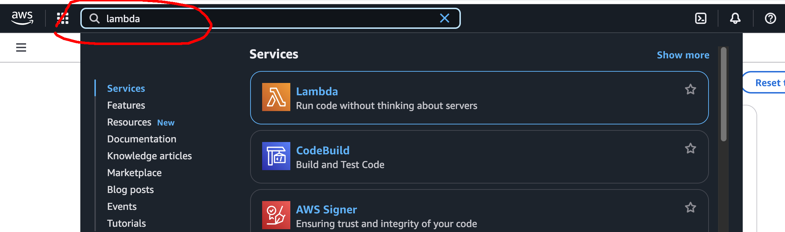
  

###### _Hint_:
> Once you use Lambda for the first time, it becomes available in `Recently visited` widget on home page

### Create a New Lambda Function

1. From the Lambda dashboard, click the orange `Create function` button
   

      
Example

      
      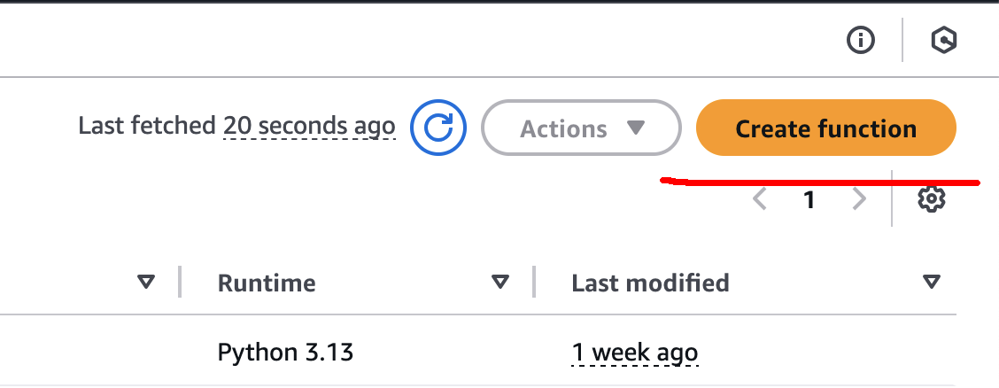
    
    

2. On the `Create function` page, select the `Author from scratch` option.
3. Fill in the required fields:
    - Function name (e.g., my_test_lambda)
    - Runtime (Python 3.13)
    - Architecture (x86_64)
   
   

      
Example

      
      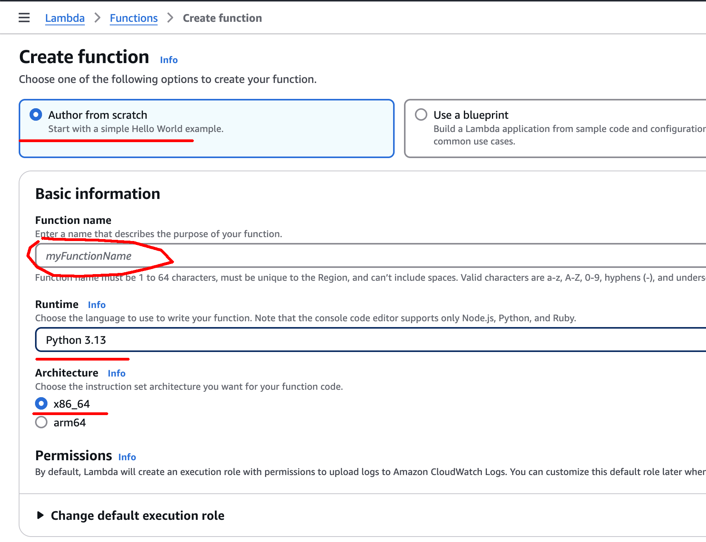
    
    

4. Scroll to the bottom of a page anf click `Create function` button

### Update Code, Save and Deploy

1. Change something in dummy function (e.g. delete comment or add extra space somewhere)
2. Click the big blue `Deploy` button on the right side of code editor

  
Example

  
  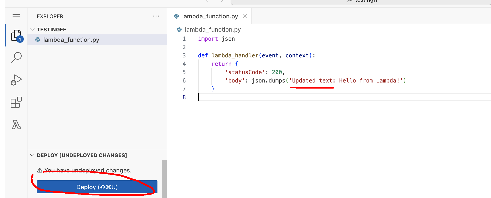

###### Note
> This step will be covered later in this document. For now, we will just use dummy function proposed by AWS

### Create Lambda Test Event

1. From top-menu click in `Test` button (next to Code)
    

      
Example

      
      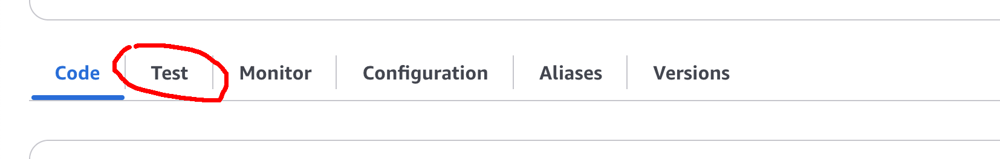
    
    

2. On the pop-up dialog select `Create new test event`
    - Enter test event name (e.g. TestEvent)
    - Event sharing settings (use Private for now)
    - Event JSON - leave it as is for now
    

      
Example

      
      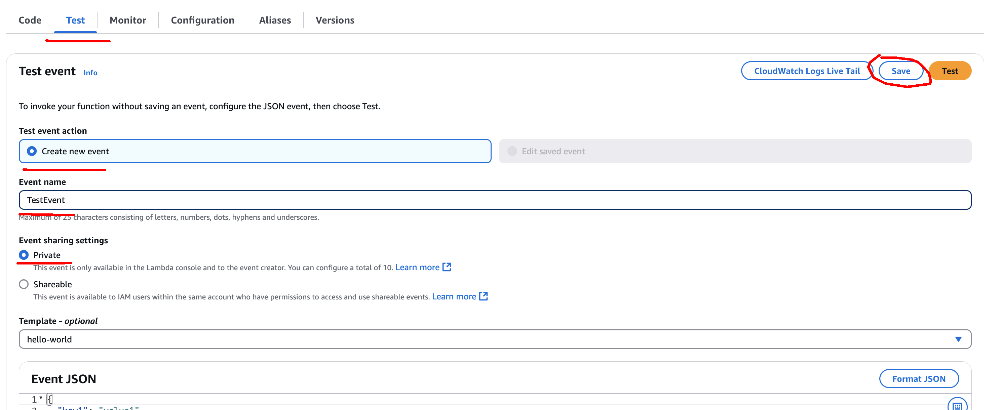
    
    

3. Click on `Save` button

### Test Lambda

1. Once test event is created, click on `Test` button on `Code Explorer` tab
    

      
Example

      
      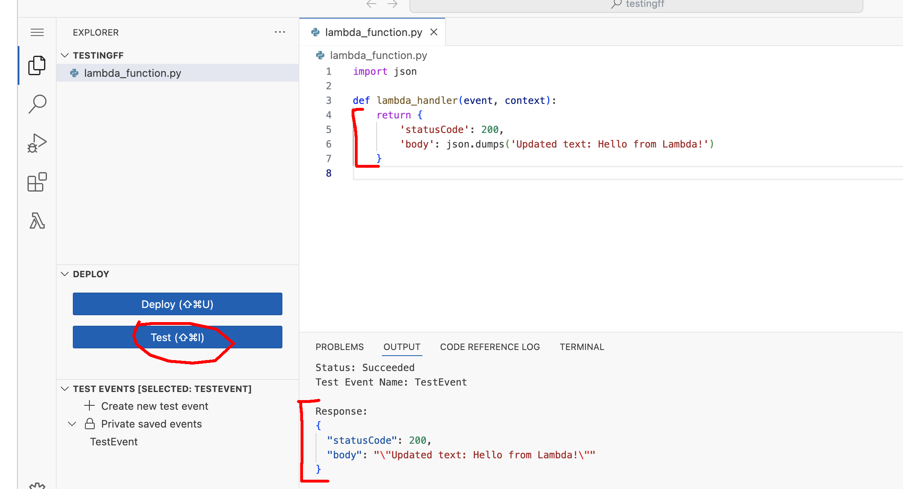
    
    

2. Update lambda code, change response body
3. Click `Deploy` and run test again
4. Make sure response is changed in the output

### Create a Lambda URL (No Authorization)

1. In the left-hand navigation, click the `Configuration` tab
2. Click `Function URL` under the sub-menu
    

      
Example

      
      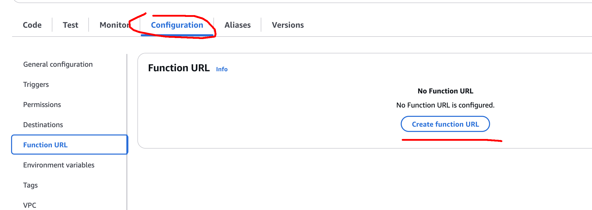
    
    

3. Click `Create function URL`:
    - Auth type: Select "None" (no authorization)
    - Leave any other defaults unless instructed otherwise
    

      
Example

      
      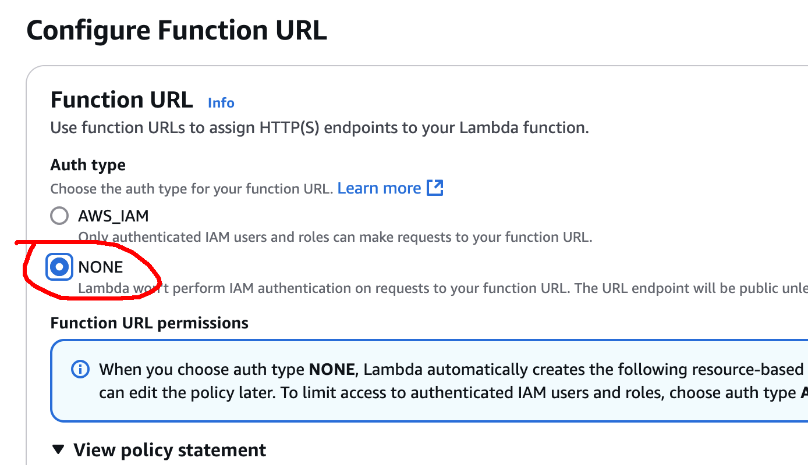
    
    

4. Scroll to bottom and click `Save`

### Test Lambda Function with your browser

1. Copy the Function URL
    

      
Example

      
      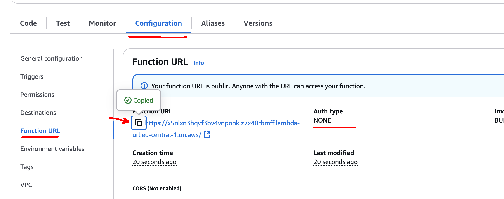
    
    

2. Use browser to invoke the lambda
    

      
Example

      
      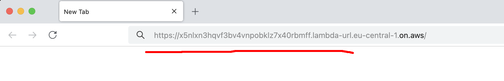
    
    

### Deleting a function

1. In top-right corner select `Actions -> Delete function`
2. Type `confirm`
3. Once function deleted, check in browser that function is no longer accessible via URL

  
Example

  
  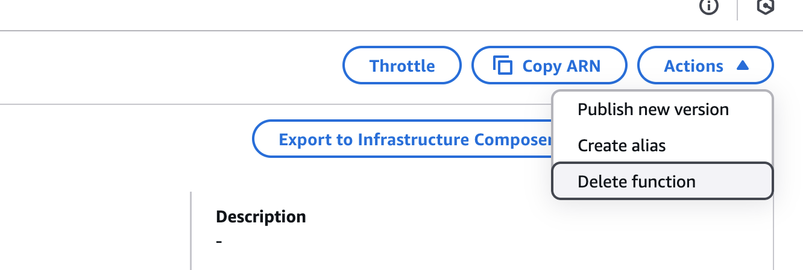

